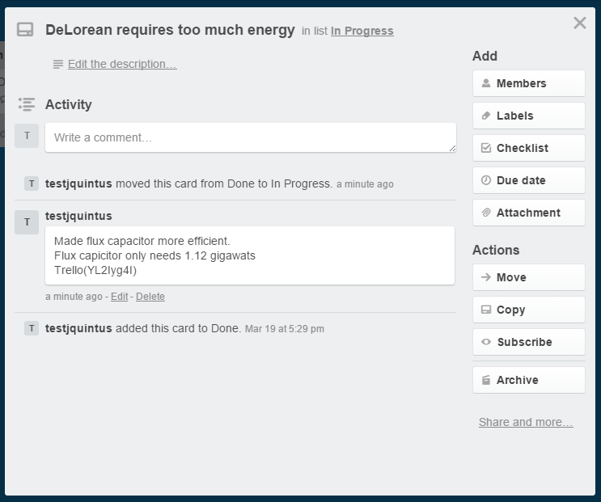

# TrelloWorld

TrelloWorld is a web service that allows you to automatically add comments to Trello cards when you push code to GitHub.  It is designed to be run as a free Azure website.  

Installation instructions can be found on the [wiki](../../wiki).  Once everything is configured, all you need to do is append Trello(cardid) to a commit.  

For example this commit comment:

    Made flux capacitor more efficient.  
    Flux capicitor only needs 1.12 gigawats
    Trello(YL2Iyg4I)
    

Wold result with this comment on your Trello card;

